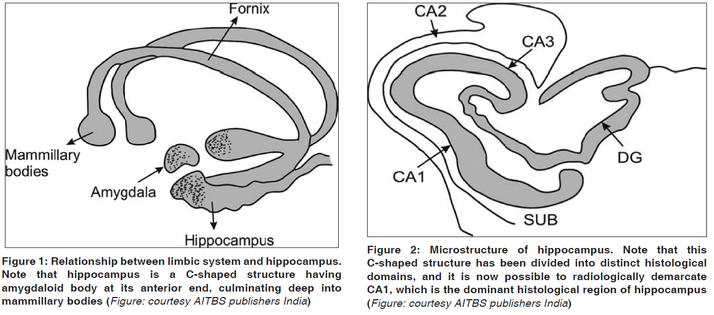

# Hippocampus in Health and Disease:  An Overview

## Introduction

- The Hippocampus is a complex brain structure that is embedded deep in the temporal lobe.
- It is posterior to limbic lobe while being the frontal part of amygdala
- It plays a major role in memory, learning, spatial navigation, emotions etc. For example, in 1930, Papez proposed that emotional response is organized in the Hippocampus and they are expressed in the ***************************************************cingulate gyrus*************************************************** via mammillary bodies.
- The hippocampus is well implicated to possess a major role in recollecting the past experience and imagining the future
- It is the most extensively studied part of the brain, and since it is densely packed with neurons, atrophy in this region can cause serious consequences, both potential and real.
- The Neural Substrate of memory, also known as long term potentiation (LTP), was first discovered in the Hippocampus.

## Hippocampal Anatomy

- Hippocampus has two parts:
    - Hippocampus Proper
    - Dentate Gyrus
    
    These two parts are seperated by hippocampal sulcus, and below the sulcus lies the ***subiculum.***
    
    (Subiculum contains ************************************************************************************************pyramidal neurons************************************************************************************************  which exhibit transitions between two modes of action potential output: 1) bursting 2) single spiking, which are thought to be inportant for routing information out of the hippocampus)
    
    The two parts mentioned above are found to curve into each other as shown in the diagram below. 
    
- Some anatomists prefer to divide the hippocampus into three parts:
    - Cornu Ammonis (CA)
    - Dentate Gyrus (DG)
    - Entorhinal Area (EC)
    
    This entire set is called as hippocampal formation.
    

- Another type of divisions for the parts of hippocampus are head, body and tail as shown below:
    - Head is the expanded part
    - Tail is the thin curved part

- Also based on histology, Hippocampus Proper (or Cornu Ammonis) is divided into CA1, CA2, CA3, and CA4 as shown below.
    
    
    

- Just opposite to CA1, we can find the subiculum which connets the hippocampus with the entorhinal cortex in the ventricle.

- Hippocampus is also covered by choroid plexus (layer of cuboidal epithelial tissues with tight junctions surrounding a core of capillaries and loose connective tissue), which prevent substances of metabolic waste from crossing the cell layer into the cerebrospinal fluid thereby acting as a blood cerebrospinal barrier (BCSB).
- The choroid plexus is also important for [Homeostasis](https://www.britannica.com/science/homeostasis) of Iron, as they are a major source of [transferrin](https://en.wikipedia.org/wiki/Transferrin) secretion.
- The brain is supplied with oxygenated blood by the cerebral artery, which has three main branches:
    - Anterior Cerebral Artery
    - Middle Cerebral Artery
    - Posterior Cerebral Artery, which supplies the hippocampus
    
    This supply of blood to the hippocampus is also reinforced by the uncal branch of the anterior choroidal artery.
    
- Veins of the hippocampus all drain into the basal vein.
    
    
    
    Angiogram representing the arteries connected to the brain
    
- Hippocampus is a three-layered structure made up of single pyramidal layers with plexiform layers on both sides, and it is anatomically and cytoarchitecturally different from the cerebral cortex.

- ************************Cerebral Cortex************************
    - It is a part of Neocortex (having six layers).
    - It is the outermost structure of the brain.
    - Outer structure is highly folded by gyri and sulci.
    

- **********************Hippocampus**********************
    - It is a part of Archicortex (having three layers, except the entorhinal area, which has six layers).
    - It is merely a small extension of the brain.
    - The upper surface (also known as the alveus) is convex (which includes dentate gyrus, subiculum, and entorhinal cortex).
    
- Another point to note is that the hippocampus has different cells in the three different layers and thus has been made the subject of many extensive studies.

The following shows a Nissl stain experiment on a cross-section of the Hippocampus. This shows the following:

1) the layers of Hippocampus proper (***Cornu Ammonis***) 

2) loosely packed pyramidal cells in the subiculum

3) entorhinal area of the hippocampal formation with its six layers

- The Hippocampus has connections both to and fro from various parts of the brain:
    - Perforant Path:
        - The [perforant pathway](https://en.wikipedia.org/wiki/Perforant_path) is a connectional route from entorhinal cortex (NOT ENTORHINAL AREA OF THE HIPPOCAMPUS!! THE ENTORHINAL CORTEX!!) to all fields of the hippocampal formation
        - Axons present in perforant path arise in layer II and layer III of entorhinal cortex with little contribution from deeper layers IV and V.
        - Axons of layer II and IV project to granule cells and pyramidal cells of CA3 while those from III and IV project to pyramidal cells of CA1 and subiculum.
        - Retrieval of information is achieved by entrohinal cortex input to CA3 (layer III of perforant path).
        - A distinct pathway also goes from entorhinal cortex (layer III of perforant path to CA1 neurons.
        - Pymaridal cells of CA1 send thier axons to the subiculum and deep layers of the entorhinal cortex and the subicular neurons send thier axons mainly to the entorhinal cortex.
        - Perforant pathway is noteworthy for severe degeneration seen in patients with Alzheimer’s disease.
    - Entorhinal Cortex:
        - The entorhinal cortex input to dentate gyrus (layer II of the perforant path) plays an important role in pattern recognition and econding of memories.
        - The hippocampus has direct connections to the entorhinal cortex (via the subiculum) and the amygdala.
        - The entorhinal cortex is the main interface between the hippocampus and neocortex.
    - Dentate Gyrus:
        - It is a deep region within hippocampus and is surrounded by the curnus ammonis (CA).
        - This plays a crucial role as a processor of information from the Entorhinal Cortex to CA3.
        - Cells lying in this region discharge at a low frequency and provide low intensity stimulation of CA3, which is said to be an  economical storage process, and this region is also pattern seperation and associate memory.
    
    **Schaffer’s Collaterals:**
    
    - These are axon collaterals (axons that branch from the main branch of another axon) given off by CA3 cells of hippocampus proper.
    - The Schaffer collateral is involved in [activity-dependent plasticity](https://en.wikipedia.org/wiki/Activity-dependent_plasticity) and the information processes that always are processed through the hippocampus.
    
    > *"Schaffer collateral is the conductor of the orchestra, but not the actual instrument that plays the music" - Dr. Patrick K. Stanton*
    > 
    - These collaterals project to area CA1 of the hippocampus and are an integral part of memory formation and the emotional network of the Papez circuit, and of the hippocampal trisynaptic loop.
    
    The following shows the Papez circuit:
    
    
    
    - The trisynaptic circuit is **a neural circuit in the hippocampus, which is made up of three major cell groups: granule cells in the dentate gyrus, pyramidal neurons in CA3, and pyramidal neurons in CA1**.
    
    The following shows the hippocampal trisynaptic loop:
    
    
    
    ******************************************Recurrent Colaterals:******************************************
    
    The collaterals that send excitatory input to CA3 and are called recurrent collaterals (RC). These play a vital role in holding memory. They accomplish this by creating a negative feedback system by connecting branch of the axon which is the recurrent collateral back into the cell body and communicates this by [Renshaw cells](https://en.wikipedia.org/wiki/Renshaw_cell).
    
    The following shows an image of how a typical collateral looks like:
    
    